# 📊 KPI Management System

> Custom Odoo 17 module for tracking project costs, labor, equipment, and profitability with a full approval workflow.


-----

## 📋 Table of Contents

- [Overview](#overview)
- [Key Features](#key-features)
- [Screenshots](#screenshots)
- [Module Structure](#module-structure)
- [Models](#models)
- [Workflow](#workflow)
- [Security](#security)
- [Installation](#installation)
- [Configuration](#configuration)
- [Usage](#usage)
- [Dependencies](#dependencies)
- [Demo Data](#demo-data)
- [Troubleshooting](#troubleshooting)
- [Contributing](#contributing)
- [License](#license)
- [Author](#author)

-----

## 🧩 Overview

The **KPI Management System** is a fully custom Odoo 17 module designed to help companies track and analyze the financial performance of their projects. It covers labor costs, equipment usage, budget control, profit margins, and integrates seamlessly with Odoo’s native Purchase and Project modules.

**Perfect for:** Construction companies, engineering firms, project-based businesses, and any organization that needs detailed cost tracking and profitability analysis.

-----

## ✨ Key Features

### 📁 Project Management

- Create KPI projects with budget, selling price, and date range
- Auto-generated reference codes using Odoo sequences (e.g. `KPI/2025/0001`)
- Link KPI projects to native Odoo projects
- Full **chatter** support (messages, activities, followers)
- Multiple views: **Kanban, Tree, Graph, and Pivot**

### 👷 Labor Tracking

|Field         |Description                                              |
|--------------|---------------------------------------------------------|
|Employee      |Linked to `hr.employee`                                  |
|Hours         |Actual hours worked                                      |
|Hour Cost     |Auto-fetched from employee’s active contract (wage ÷ 160)|
|Subtotal      |Hours × Hour Cost                                        |
|Overtime Hours|Hours exceeding 8h/day                                   |
|Utilization % |Actual hours ÷ Planned hours × 100                       |
|Cost Share %  |Labor subtotal ÷ Total project cost × 100                |

### 🏗️ Equipment Tracking

|Field        |Description                                  |
|-------------|---------------------------------------------|
|Equipment    |Linked to `maintenance.equipment`            |
|Quantity     |Number of units                              |
|Days         |Actual days used                             |
|Day Cost     |Cost per day                                 |
|Subtotal     |Days × Day Cost × Quantity                   |
|Utilization %|Actual days ÷ Planned days × 100             |
|Cost Share % |Equipment subtotal ÷ Total project cost × 100|

### 💰 Financial KPIs (Auto-Computed)

|KPI                 |Formula                       |
|--------------------|------------------------------|
|Total Labor Cost    |Sum of all labor subtotals    |
|Total Equipment Cost|Sum of all equipment subtotals|
|Total Cost          |Labor + Equipment             |
|Profit              |Selling Price − Total Cost    |
|Profit Margin %     |Profit ÷ Selling Price × 100  |
|Remaining Budget    |Budget − Total Cost           |
|Over Budget         |True if Total Cost > Budget   |

### 🛒 Purchase Order Wizard

- Open wizard directly from the project form
- Select which equipment lines to convert to POs
- Assign vendor and estimated cost per line
- Auto-creates Purchase Orders and logs a message in the project chatter

### 📄 QWeb PDF Report

- Professional PDF report per project
- Includes: project info, financial summary, labor details, equipment details
- Print-ready format for stakeholders and management

-----

## 📸 Screenshots

### 📋 Projects List View

Track all projects with complete financial overview and workflow status filters.

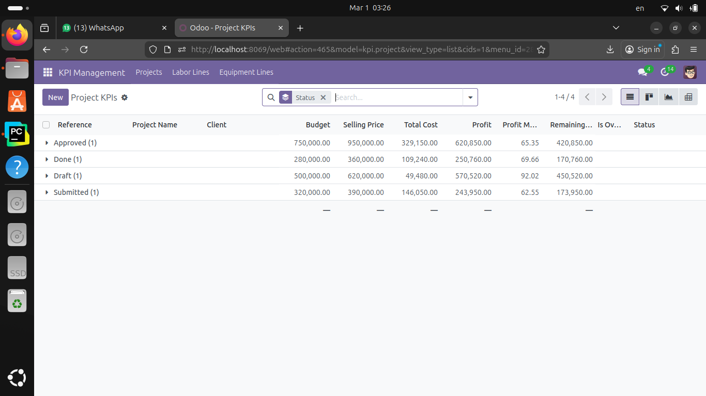

-----

### 📊 Kanban Board

Drag-and-drop projects across workflow stages (Draft → Submitted → Approved → Done).

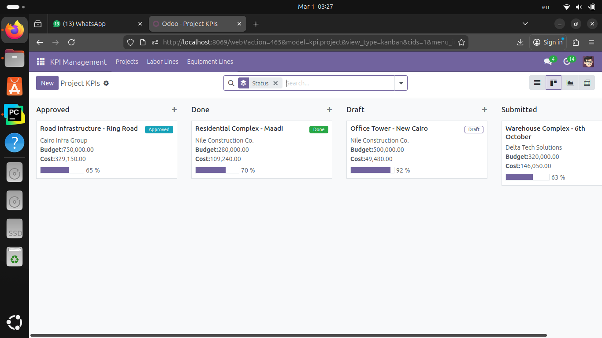

-----

### 👷 Project Form - Labor Tracking

Monitor employee hours with automatic cost calculations and smart buttons showing related records.

<p align="center">
  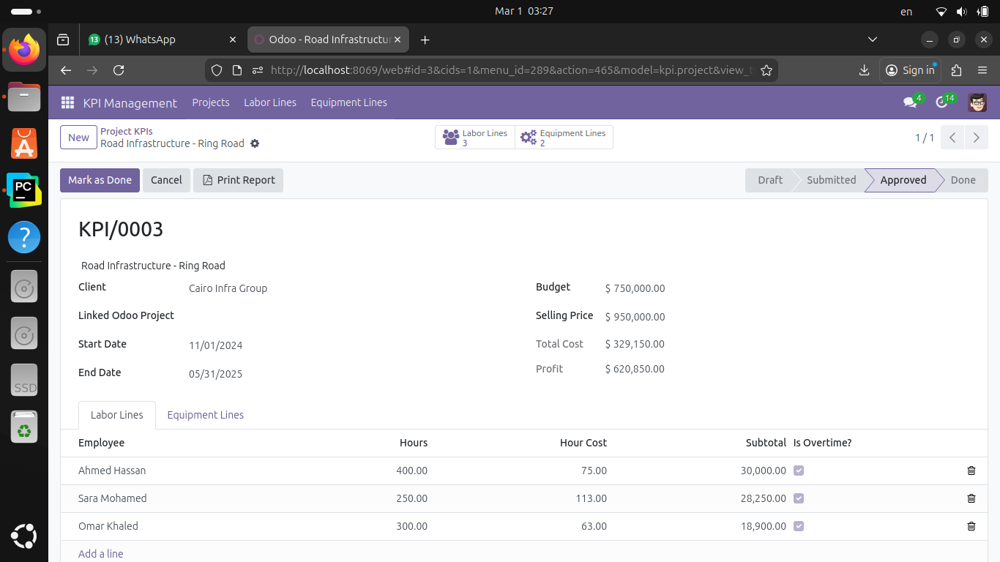
</p>

-----

### 📄 Professional PDF Report

Print-ready report with complete project info, financial summary, labor and equipment details.

<p align="center">
  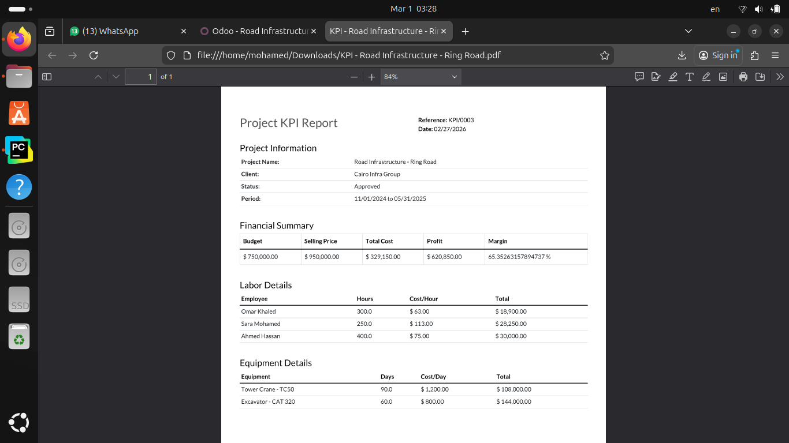
</p>

-----

### 📋 Labor Lines - List View

Comprehensive view of all labor entries grouped by project with hours and costs.

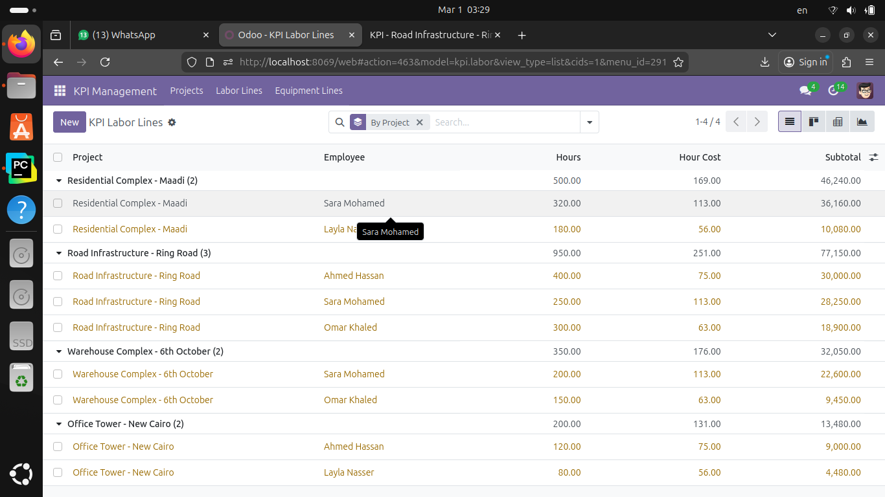

-----

### 👥 Labor Lines - Kanban View

Visual cards showing employee assignments, hours, costs, and utilization per project.

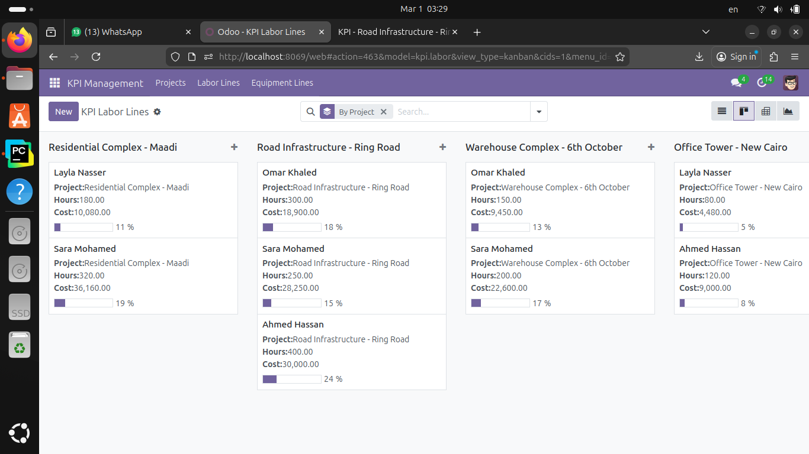

-----

### 🏗️ Project Form - Equipment Management

Track equipment usage with quantity, days, and costs per line.

<p align="center">
  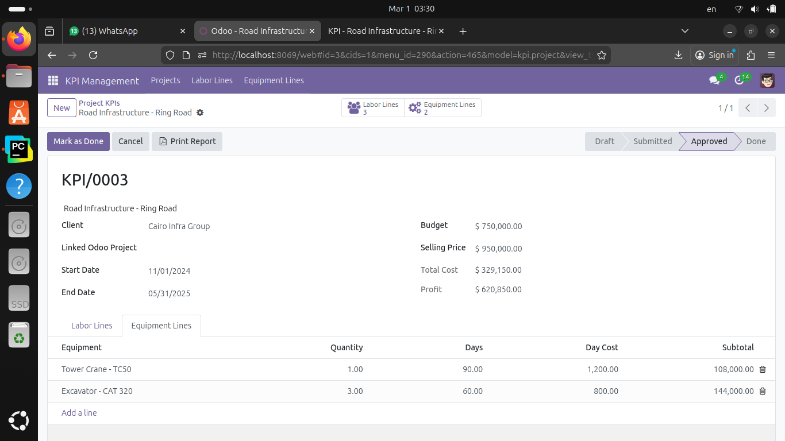
</p>

-----

### 📊 Labor Details - Time & Cost Analysis

Detailed breakdown showing days worked, subtotal, overtime hours, and cost indicators.

<p align="center">
  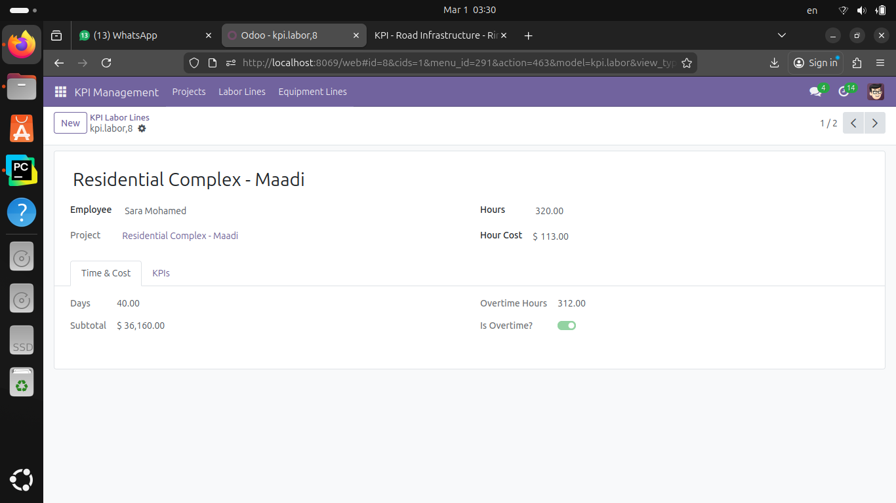
</p>

-----

### 📈 Labor Details - KPIs Dashboard

Real-time utilization percentage, cost share analysis, and over-allocation alerts.

<p align="center">
  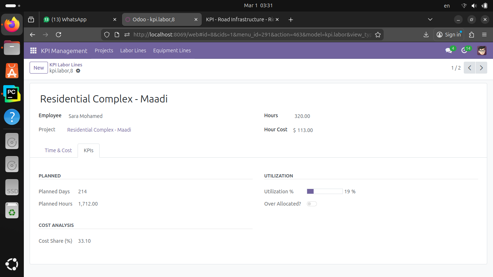
</p>

-----

### 🚜 Equipment Lines - List View

Complete equipment tracking grouped by project with quantities, days, and costs.

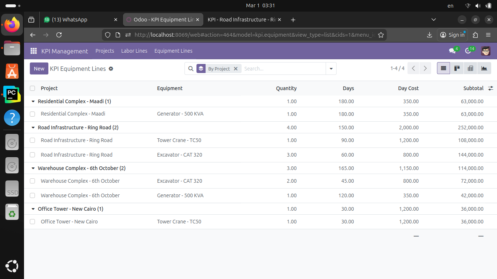

-----

### 🏗️ Equipment Lines - Kanban View

Visual cards displaying equipment assignments per project with utilization progress bars.

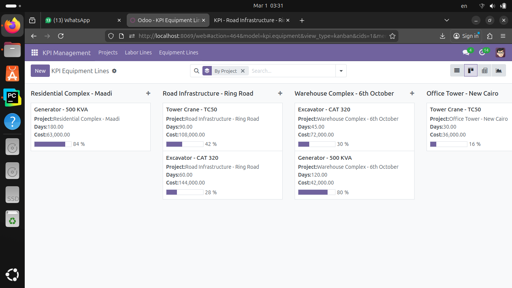

-----

### 🔧 Equipment Details - Time & Cost

Equipment usage breakdown with hours, day costs, subtotals, and planned metrics.

<p align="center">
  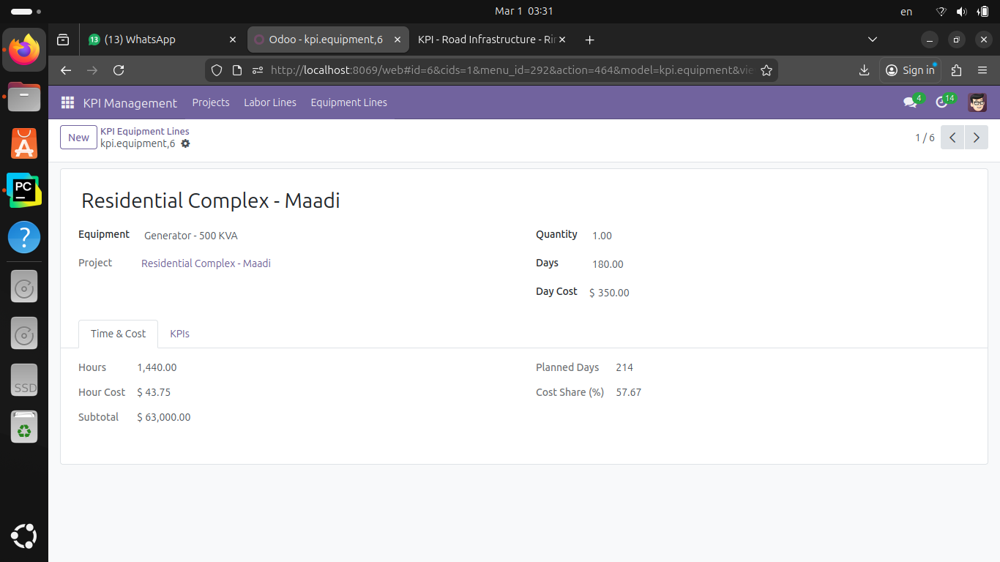
</p>

-----

### 📊 Equipment Details - KPIs Dashboard

Utilization percentage and cost share analysis for each equipment line.

<p align="center">
  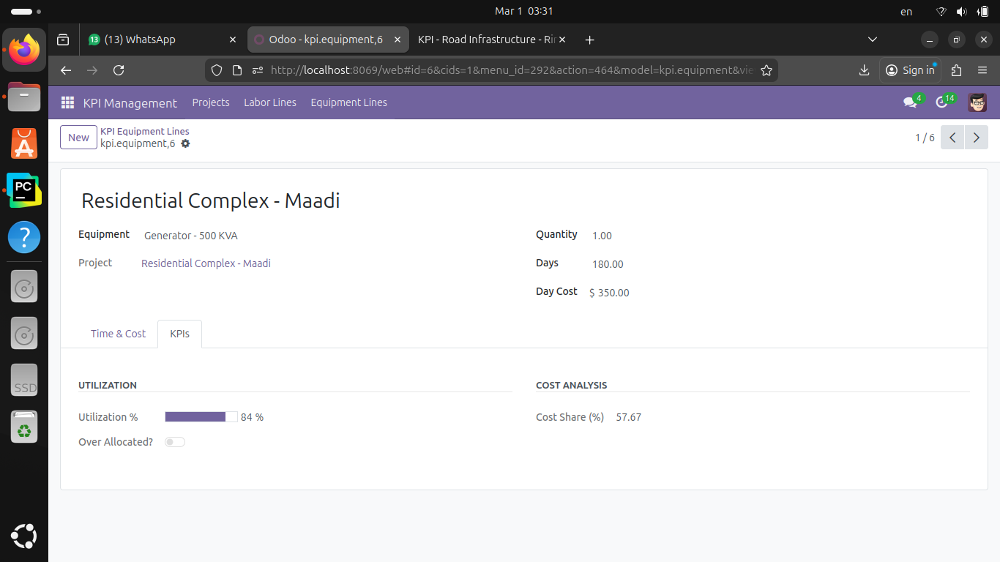
</p>

-----

### 🛒 Purchase Order Wizard

Convert equipment lines to purchase orders with one click - select items and assign vendors.

<p align="center">
  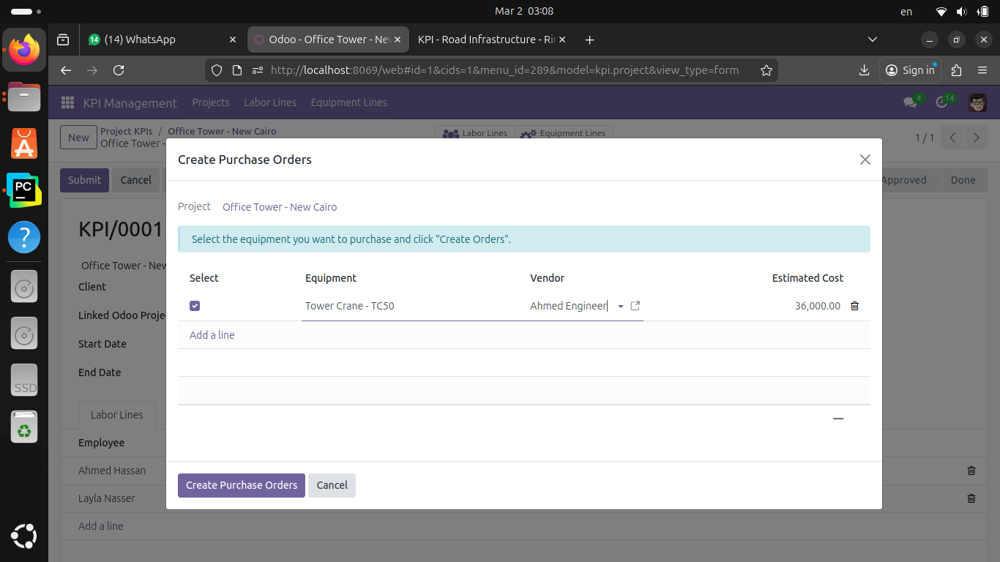
</p>

-----

> 💡 **Pro Tip:** All views support advanced filtering, grouping, and export to Excel!

-----

## 📁 Module Structure

```
project_costing/
├── models/
│   ├── __init__.py
│   ├── kpi_project.py        # Main project model — workflow, KPIs, security
│   ├── kpi_labor.py          # Labor lines — cost, overtime, utilization
│   └── kpi_equipment.py      # Equipment lines — cost, utilization
│
├── wizard/
│   ├── __init__.py
│   ├── kpi_purchase_wizard.py       # Wizard to create Purchase Orders
│   └── kpi_purchase_wizard_line.py  # Wizard line model
│
├── views/
│   ├── kpi_project_views.xml    # Tree, Form, Kanban, Graph, Pivot, Search
│   ├── kpi_labor_views.xml      # Labor standalone views
│   ├── kpi_equipment_views.xml  # Equipment standalone views
│   ├── project_inherit.xml      # Smart button on native project form
│   └── kpi_menus.xml            # Menu structure
│
├── reports/
│   └── kpi_project_report.xml   # QWeb PDF report template + action
│
├── security/
│   ├── groups.xml               # KPI User & KPI Manager groups
│   ├── kpi_security.xml         # Record rules (users see own projects only)
│   └── ir.model.access.csv      # Model access rights
│
├── data/
│   └── kpi_project_sequence.xml # Auto reference sequence
│
├── demo/
│   └── demo_data.xml            # Demo projects in all workflow states
│
├── static/
│   └── description/
│       ├── icon.png             # Module icon
│       └── index.html           # Module description (Apps store)
│
├── __init__.py
├── __manifest__.py
└── README.md
```

-----

## 🗂️ Models

### `kpi.project`

Main model that holds all project data.

**Key fields:**

```python
name          # Project name (required)
code          # Auto-generated reference (e.g. KPI/2025/0001)
client_id     # res.partner — the client
budget        # Monetary — project budget
selling_price # Monetary — agreed selling price
start_date    # Project start date
end_date      # Project end date
project_id    # Link to native project.project
state         # Workflow state
labor_ids     # One2many → kpi.labor
equipment_ids # One2many → kpi.equipment

# Computed
total_labor_cost     # Sum of labor subtotals
total_equipment_cost # Sum of equipment subtotals
total_cost           # Labor + Equipment
profit               # selling_price - total_cost
profit_margin        # profit / selling_price * 100
remaining_budget     # budget - total_cost
is_over_budget       # True if total_cost > budget
```

### `kpi.labor`

Labor lines linked to a project.

**Key fields:**

```python
project_id         # Many2one → kpi.project
employee_id        # Many2one → hr.employee
hours              # Float — actual hours worked
hour_cost          # Auto-computed from contract wage ÷ 160
subtotal           # hours × hour_cost
days               # hours ÷ 8
overtime_hours     # hours - 8 if hours > 8
planned_hours      # project_days × 8
utilization_percent # hours / planned_hours * 100
cost_share_percent  # subtotal / total_cost * 100
```

### `kpi.equipment`

Equipment lines linked to a project.

**Key fields:**

```python
project_id          # Many2one → kpi.project
equipment_id        # Many2one → maintenance.equipment
quantity            # Float — number of units
days                # Float — days used
day_cost            # Monetary — cost per day
subtotal            # days × day_cost × quantity
planned_days        # project end_date - start_date
utilization_percent # days / planned_days * 100
cost_share_percent  # subtotal / total_cost * 100
```

-----

## 🔄 Workflow

```
Draft ──► Submitted ──► Approved ──► Done
  │           │              │
  └───────────┴──────────────┴──► Cancelled
                                      │
                              (Manager only) ▼
                                    Draft
```

|Transition            |Button      |Condition                                     |
|----------------------|------------|----------------------------------------------|
|Draft → Submitted     |Submit      |Must have at least 1 labor or equipment line  |
|Submitted → Approved  |Approve     |Auto-creates a task in the linked Odoo project|
|Approved → Done       |Mark as Done|Selling Price must be set                     |
|Any → Cancelled       |Cancel      |Available from Draft, Submitted, Approved     |
|Done/Cancelled → Draft|Reopen      |**Managers only**                             |

-----

## 🔐 Security

### Groups

|Group          |Permissions                                 |
|---------------|--------------------------------------------|
|**KPI User**   |Read, Write, Create — own projects only     |
|**KPI Manager**|Full access — all projects + delete + reopen|

### Record Rules

- **Users** can only see projects they created
- **Managers** can see all projects

### Field-Level Security

- Projects in `Done` or `Cancelled` state are **locked**
- Regular users cannot edit or delete locked projects
- Only system fields (computed fields, chatter) can be updated on locked records
- Managers can reopen locked projects

-----

## ⚙️ Installation

### Prerequisites

- Odoo 17.0 or higher
- PostgreSQL 12 or higher
- Python 3.10+

### Installation Steps

**1. Clone the repository:**

```bash
cd /path/to/odoo/addons/
git clone https://github.com/MohamedAlaaElhakim/project_costing.git
```

**2. Restart Odoo server:**

```bash
sudo systemctl restart odoo
# or
./odoo-bin --config=/path/to/odoo.conf
```

**3. Update addons list:**

- Enable **Developer Mode** → Settings → Activate the developer mode
- Go to **Apps → Update Apps List**

**4. Install the module:**

- Search for **KPI Management System**
- Click **Install**

-----

## 🔧 Configuration

### Initial Setup

1. **Create User Groups:**
- Go to `Settings → Users & Companies → Groups`
- Assign users to either `KPI User` or `KPI Manager` group
1. **Configure Equipment:**
- Go to `Maintenance → Equipment`
- Create equipment records that will be used in projects
1. **Set Employee Contracts:**
- Go to `Employees → Contracts`
- Ensure all employees have active contracts with wage information

### Optional Configuration

- **Customize Sequence Format:**
  - Navigate to `Settings → Technical → Sequences`
  - Search for `KPI Project Sequence`
  - Modify prefix, padding, or number format
- **PDF Report Customization:**
  - Edit `reports/kpi_project_report.xml` to match your company branding

-----

## 🚀 Usage

### Creating a New Project

1. Go to `KPI → Projects → Create`
1. Fill in project details (name, client, budget, dates)
1. Add labor lines (employees + hours)
1. Add equipment lines (equipment + days)
1. Review auto-computed financial KPIs
1. Submit for approval

### Generating Purchase Orders

1. Open an approved project
1. Click **Create Purchase Orders** button
1. Select equipment lines to convert
1. Assign vendor and cost
1. Confirm — POs will be created automatically

### Printing Reports

1. Open any project
1. Click **Print → KPI Project Report**
1. PDF will be generated with all project details

-----

## 📦 Dependencies

The following Odoo apps must be installed before this module:

|Module       |Purpose                        |Version|
|-------------|-------------------------------|-------|
|`project`    |Native project linking         |17.0   |
|`hr`         |Employee management            |17.0   |
|`hr_contract`|Auto-fetch employee hourly rate|17.0   |
|`maintenance`|Equipment tracking             |17.0   |
|`purchase`   |Purchase order creation        |17.0   |
|`mail`       |Chatter, activities, followers |17.0   |

-----

## 🎭 Demo Data

The module includes demo data with 4 projects covering all workflow states:

|Project                        |State    |Client               |Budget   |
|-------------------------------|---------|---------------------|---------|
|Office Tower - New Cairo       |Draft    |Nile Construction Co.|500,000  |
|Warehouse Complex - 6th October|Submitted|Delta Tech Solutions |350,000  |
|Road Infrastructure - Ring Road|Approved |Cairo Infra Group    |1,200,000|
|Residential Complex - Maadi    |Done     |Nile Construction Co.|800,000  |


> **Note:** Demo data only loads if your Odoo database was created with **“Load demonstration data”** enabled.

-----

## 🐛 Troubleshooting

### Common Issues

**Issue:** “Hour cost is not calculated automatically”

- **Solution:** Ensure the employee has an active contract with a wage defined in `hr.contract`

**Issue:** “Cannot submit project - validation error”

- **Solution:** Add at least one labor or equipment line before submitting

**Issue:** “Purchase Order wizard not appearing”

- **Solution:** Ensure `purchase` module is installed and you have equipment lines in the project

**Issue:** “Record rules preventing access”

- **Solution:** Check user groups — only assigned users or managers can see projects

### Getting Help

- Check [Odoo Documentation](https://www.odoo.com/documentation/17.0/)
- Open an issue on [GitHub](https://github.com/MohamedAlaaElhakim/project_costing/issues)
- Contact the author directly (see contact info below)

-----

## 🤝 Contributing

Contributions are welcome! Here’s how you can help:

1. Fork the repository
1. Create a feature branch (`git checkout -b feature/AmazingFeature`)
1. Commit your changes (`git commit -m 'Add some AmazingFeature'`)
1. Push to the branch (`git push origin feature/AmazingFeature`)
1. Open a Pull Request

### Coding Standards

- Follow [Odoo Development Guidelines](https://www.odoo.com/documentation/17.0/developer/reference/backend/guidelines.html)
- Use meaningful variable and function names
- Add comments for complex logic
- Update documentation when adding new features

-----

## 📄 License

This project is licensed under the **GNU Affero General Public License v3.0** (AGPL-3.0).

See the <LICENSE> file for details.

-----

## 👤 Author

**Mohamed Alaa Elhakim**  
Odoo Developer | Python | ERP Solutions

[](https://www.linkedin.com/in/mohamedalaaelhakim)
[](mailto:mohamed.alaa918214@gmail.com)
[](https://wa.me/201019272209)
[](https://github.com/MohamedAlaaElhakim)

-----

**⭐ If you find this module useful, please give it a star on GitHub!**